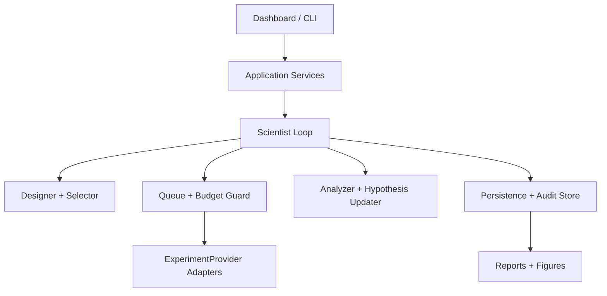
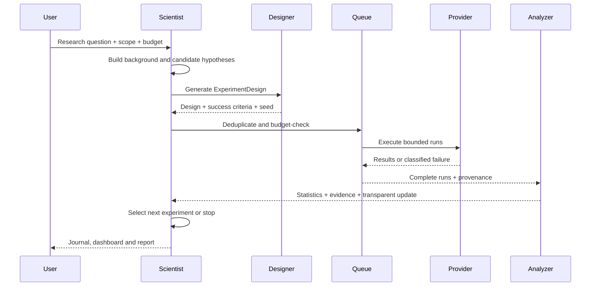

# AI Scientist Mini Architecture

本文件描述 AI Scientist Mini 的稳定边界。实现可以替换 UI、存储和统计库，
但不能绕过预算、审计、去重和人工批准边界。

## 1. Design goals

1. **闭环优先**：研究问题必须能够从假设一路走到实验、结果、更新和下一轮选择。
2. **规则透明**：每一次置信度和状态更新都记录规则 ID、输入 evidence 和旧/新值。
3. **本地可复现**：同一配置、seed、数据哈希和代码版本应产生可比较的结果。
4. **Provider 隔离**：核心循环不依赖任何模型厂商、网络或其他项目源码。
5. **资源受控**：执行前和每个 run 前都检查 budget、run limit、runtime 和 stop signal。

## 2. Layered view



### Domain layer

Domain objects are serializable records with stable IDs and timestamps:

- `ResearchProject`: question, scope, constraints, resources, metrics, budget, status;
- `Hypothesis`: statement, rationale, predictions, test method, confidence, status, evidence IDs;
- `ExperimentDesign`: independent/dependent variables, control, dataset, sample size, seed,
  metric, procedure, success criteria;
- `Experiment`: design plus queue status and provider metadata;
- `ExperimentRun`: run ID, attempt, started/finished timestamps, seed, environment, status;
- `Result`: raw metric values, aggregate statistics, artifacts and provenance;
- `Evidence`: source result, interpretation, strength and rule ID;
- `JournalEntry`: public decision summary and links; never private chain-of-thought;
- `AuditEvent`: append-only event with actor (`rule`, `user`, `provider`, `system`), action,
  input/output references and hash.

IDs are opaque UUIDs (or deterministic IDs for deduplication keys); callers must not infer
meaning from their textual format.

## 3. Scientific loop



The loop is resumable after any event. A crash between two events must not create a phantom
result: an execution is first persisted as `Running`, then committed atomically as `Complete`
or `Failed` with its logs and provenance.

## 4. Provider contract

All backends implement one local interface, conceptually:

```python
class ExperimentProvider(Protocol):
    name: str

    def validate(self, design: ExperimentDesign) -> ValidationResult: ...

    def run(
        self,
        design: ExperimentDesign,
        *,
        seed: int,
        run_id: str,
        budget: RunBudget,
        stop_event: StopEvent,
    ) -> ProviderResult: ...
```

Required first-party implementations:

- `SyntheticProvider`: deterministic benchmark tasks generated from seed;
- `PythonFunctionProvider`: explicitly registered local function, no arbitrary import from user input;
- `MockLLMExperimentProvider`: scripted model-like responses for adapter testing.

Future integrations (`LLM Lab`, `Agent Arena`, `Synthetic Benchmark Factory`, `Paper2Lab`)
must be separate adapters. They communicate via versioned JSON, CLI or API and cannot bypass
the core budget guard. Credentials and network access are opt-in, never part of the default demo.

## 5. Queue and state machines

### Experiment queue

```text
Queued → Running → Complete
                  ↘ Failed
Queued → Cancelled
Running → Cancelled (after cooperative stop)
```

`Failed` is an execution/design state, not a hypothesis judgment. The failure payload must
contain one of:

- `infrastructure_failure` — provider, filesystem, process or timeout issue;
- `invalid_design` — validation or precondition failure;
- `insufficient_data` — run completed but cannot support the requested statistic;
- `negative_result` — valid execution whose measured outcome does not support a prediction.

### Hypothesis state

`Untested → Supported`, `Untested → Inconclusive`, `Untested → Rejected` and equivalent
transitions after later evidence are allowed only through a named update rule. A negative result
does not imply `Rejected` when the run is failed or underpowered.

## 6. Budget guard

`BudgetGuard` runs before enqueue, before each run, and at report finalization. It tracks both
reserved and consumed amounts to prevent concurrent oversubscription:

```text
remaining_experiments = max_experiments - committed_experiments - reserved_experiments
remaining_runs        = max_runs - committed_runs - reserved_runs
remaining_runtime     = max_runtime - elapsed_runtime - reserved_runtime
remaining_cost        = budget - committed_cost - reserved_cost
```

Any limit breach produces a structured `BudgetExceeded` event and leaves the experiment in a
safe terminal state. `StopButton` sets a cooperative cancellation flag; providers must check it
between samples and before expensive work. Hard process termination is a last-resort UI action
and is logged as infrastructure failure.

## 7. Deduplication and memory

Before execution, canonicalize the design (sorted JSON, normalized numeric values), then compute:

```text
dedupe_key = SHA-256(provider + canonical_design + seed + data_hash + code_version)
```

The memory index checks:

1. exact completed key (reuse result);
2. same design/seed with enough runs (do not repeat);
3. same design with a different seed (allowed only if budget and power policy permit);
4. known failed design (requires explicit follow-up reason).

Deduplication decisions are persisted as audit events and journal summaries.

## 8. Analysis and hypothesis updates

The analyzer computes mean, median, standard deviation, confidence interval, simplified effect
size, and success rate. It also records sample size and missing/failed runs. A rule may update
confidence only from persisted evidence:

```text
confidence_delta = clamp(rule(weight, effect_size, uncertainty, success_rate), -1, +1)
new_confidence = clamp(old_confidence + confidence_delta, 0, 1)
```

The actual formula and threshold are versioned (`rule_id`, `rule_version`) and shown in the
report. The system must phrase conclusions as “supported under this synthetic configuration”
rather than claiming discovery of scientific truth.

Experiment selection scores candidates with an auditable heuristic:

- `Random`: seeded random choice;
- `BestExpectedInformation`: expected uncertainty reduction minus cost;
- `UncertaintyFirst`: highest confidence interval width / lowest evidence;
- `FollowUpFailedResult`: repair or repeat only an explicitly classified failed design.

## 9. Reproducibility manifest

Each experiment stores a manifest like:

```json
{
  "experiment_id": "exp-...",
  "design_hash": "sha256:...",
  "provider": "synthetic",
  "seed": 42,
  "environment": {"python": "3.11.x", "platform": "..."},
  "code_version": "git-or-package-version",
  "data_hash": "sha256:...",
  "config": {},
  "result_hash": "sha256:...",
  "log_hash": "sha256:...",
  "created_at": "RFC-3339 timestamp"
}
```

The manifest is immutable after completion. A rerun creates a new attempt and links back to the
original; it never edits historical evidence.

## 10. Audit trail and public journal

The append-only audit trail answers:

```text
Which hypothesis → which experiment → which run → which result → which evidence
→ which rule changed confidence/status → which decision selected the next experiment?
```

Every state mutation emits an `AuditEvent` with references and hashes. The Scientist Journal is
a safe projection of those events containing only public decision summaries:

- why this experiment was selected;
- configuration and constraints;
- what happened (including failures);
- result and uncertainty;
- why the next action was selected.

No hidden reasoning or model-private chain-of-thought is persisted.

## 11. Persistence and restart

SQLite is the preferred transactional store for the desktop build; JSON export/import is the
interchange format. Write operations use migrations and transactions. On startup:

1. load the latest schema;
2. mark stale `Running` records as `Failed/infrastructure_failure` after recovery policy;
3. restore budgets, queue, evidence and journal;
4. continue only queued experiments within remaining limits.

Partial artifacts are retained for diagnosis, but are never promoted to Result without a commit
event and provenance manifest.

## 12. Report contract

The final report includes Research Question, Background, Hypotheses, Methods, all Experiments,
Results, Figures, Interpretation, rejected/inconclusive hypotheses, Limitations, audit links and
Next Work. Every figure has a source experiment/result ID and a reproducible data extract.

## 13. Extension checklist

An adapter or selector is ready only when it:

- implements validation, bounded execution and cooperative cancellation;
- emits deterministic metadata and a data hash;
- has unit tests for budget breach, timeout, duplicate and failure classification;
- cannot access network or secrets unless explicitly enabled;
- serializes through versioned JSON;
- documents limitations and expected external cost.
