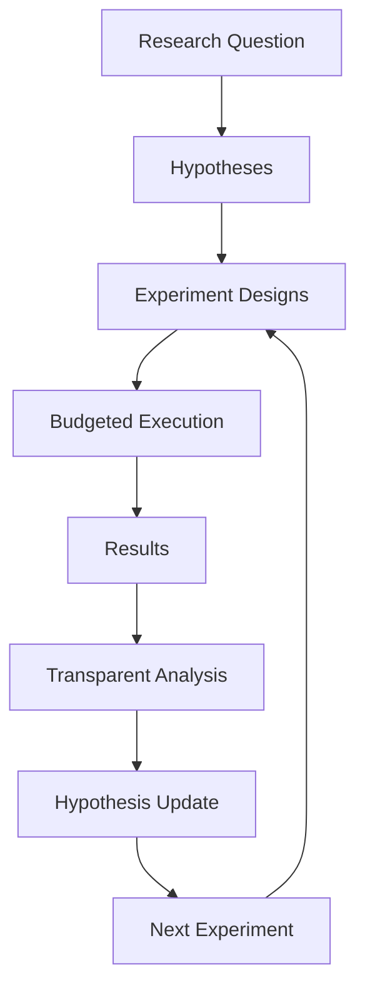

# AI Scientist Mini architecture

## Scientific loop

## Boundaries

| Layer | Responsibility | Deliberate constraint |
| --- | --- | --- |
| Domain | Projects, hypotheses, configs, runs, budget, queue, audit | JSON-serializable records |
| Scientist | Rule-based proposal, selection, update, journal | Every rule is named and logged |
| Providers | Synthetic, Python function, mock LLM experiment | No paid API in development |
| Analysis | Mean, median, standard deviation, CI, effect size, success rate | Small-sample caveats are retained |
| Persistence | SQLite study store plus export JSON | Reopen/continue is deterministic |
| Reporting | Markdown/HTML report and figures | No hidden reasoning text |
| UI | Tkinter dashboard and stop/approval controls | UI never bypasses budget |
| Adapters | `LocalJsonAdapter` plus reserved external adapter names | JSON/CLI boundary; no direct project imports or network calls |

## Failure taxonomy

`InfrastructureFailure`, `InvalidDesign`, `InsufficientData`, and
`NegativeResult` are distinct. Only a negative result supplies evidence against
a hypothesis; infrastructure and design problems cause a re-plan.

## Reproducibility record

Every run stores its configuration, seed, environment, code version, data hash,
result, logs, and status. Deduplication hashes the normalized configuration
and seed before a provider is called.

## Selection heuristics

The first release provides `random`, `best_expected_information`,
`uncertainty_first`, and `follow_up_failed_result`. Their names and scores are
stored in the audit trail so a later reviewer can reproduce why a run was
selected.

## Integration contract

An adapter receives a JSON object with `provider`, `config`, optional `seed`,
and optional `metadata`, and returns a JSON object containing the protocol
version, provider name, normalized `ProviderResult`, and metadata.  The
development registry allows only `synthetic` and `mock` providers.  Future
connectors can implement `ExperimentAdapter` in their own package and be
enabled explicitly after human review and budget integration.
